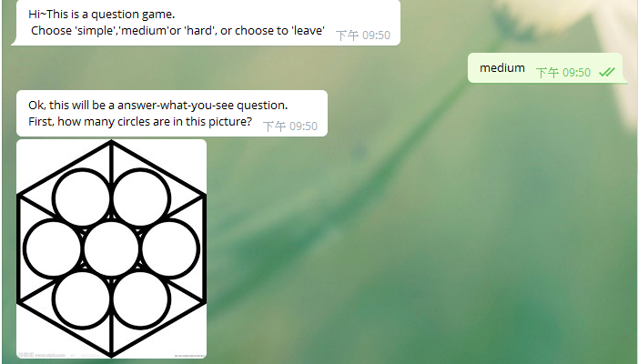

# TOC Final Project - Question Game Bot


## Start

To activate the bot, you should say 

```sh
hello
```
Or, it won't do anything to your message until you say `hello` to it.

## Start Playing - Choose the level

Then it'll ask you to choose the level or to leave.


(1)for simple 

```sh
simple
```

(2)for medium

```sh
medium
```

(3)for hard
```sh
hard
```

(4)for leave

```sh
leave
```


Three levels have three stages for each.

Once you pass the three stagesm it'll go back and ask you if you want to play or leave.

OK, let's show you the detailed of the three games.

## Simple - Arithmetic Game

For simple level, it's an arithmetic game.

For this game, each stage will give you an arithmetic operation. 

To pass it, just enter the result of that arithmetic operation.

For some reasons, I'll just show you the first stage.


## Medium - Answer-what-you-see Game

Just like the title, in this level, each stages will give you a picture and a question.

Answering the question based on the picture correctly and you'll pass.

Same, I'll just show you the first stage.



## Hard - Listening Game

In this level, each stage will provide an audio file, and a question.

Same, just answer it correctly to pass the stages.

The following is the first stage of it.


## Leave

Once you say `leave` to the bot, you'll need to say `hello` again to reactivate it.


