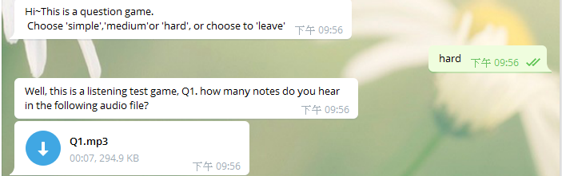
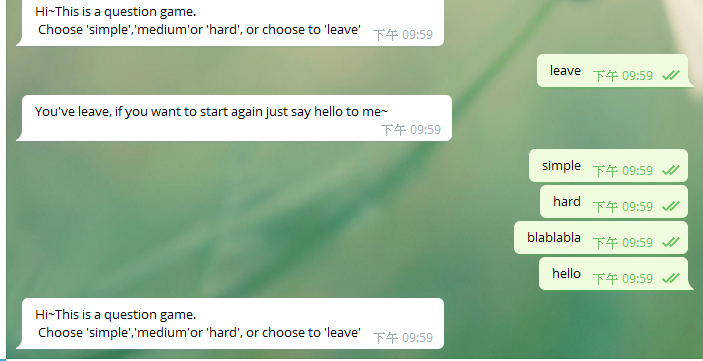

# TOC Final Project - Question Game Bot


## Start

To activate the bot, you should say 

```sh
hello
```
Or, it won't do anything to your message until you say `hello` to it.

## Start Playing - Choose the level

Then it'll ask you to choose the level or to leave.


(1)for simple 

```sh
simple
```

(2)for medium

```sh
medium
```

(3)for hard
```sh
hard
```

(4)for leave

```sh
leave
```


Three levels have three stages for each.

Once you pass the three stages, it'll go back and ask you if you want to play or leave.

OK, let's show you the detailed of the three games.

## Simple - Arithmetic Game

For simple level, it's an arithmetic game.

For this game, each stage will give you an arithmetic operation. 

To pass it, just enter the result of that arithmetic operation correctly.

If you give a wrong answer, it'll tell you wrong and let you answer again and again until you answer it correctly.

(For Medium and Hard level, it is adopeted as well)

(For some reasons, I'll just show you the first stage for example)


## Medium - Answer-what-you-see Game

Just like the title, in this level, each stages will give you a picture and a question.

Answering the question based on the picture correctly and you'll pass.

Same, I'll just show you the first stage.


## Hard - Listening Game

In this level, each stage will provide an audio file, and a question.

Same, just answer it correctly to pass the stages.

The following is the first stage of it.



## Leave

If you say `leave` to the bot at the when the bot asks you if you want to leave
, you'll need to say `hello` again to reactivate it.




## Internal Operation - FSM Structure


The initail state is `startstate`, you should say `hello` to it to go to the `user` state.

From `user` state, it is `advance` to `state1`,`state2` and `state3`,
representing the 'simple', 'medium' and 'hard' level seperately, and a `go_back` to `startstate` is to 'leave'.

For the three `advance` sequences, each of them has four states, 
first three states represent the three stages of each sequence, 
and the fourth represents that you pass the level. 

It'll print something encourage words to congratulate you and `go_back` to the `user` state immediately.


## Other

Don't worry that the question is to hard, there's a file called 'Answer_List.txt' in this folder. 

In this file, there are the answers to all of the questions.


